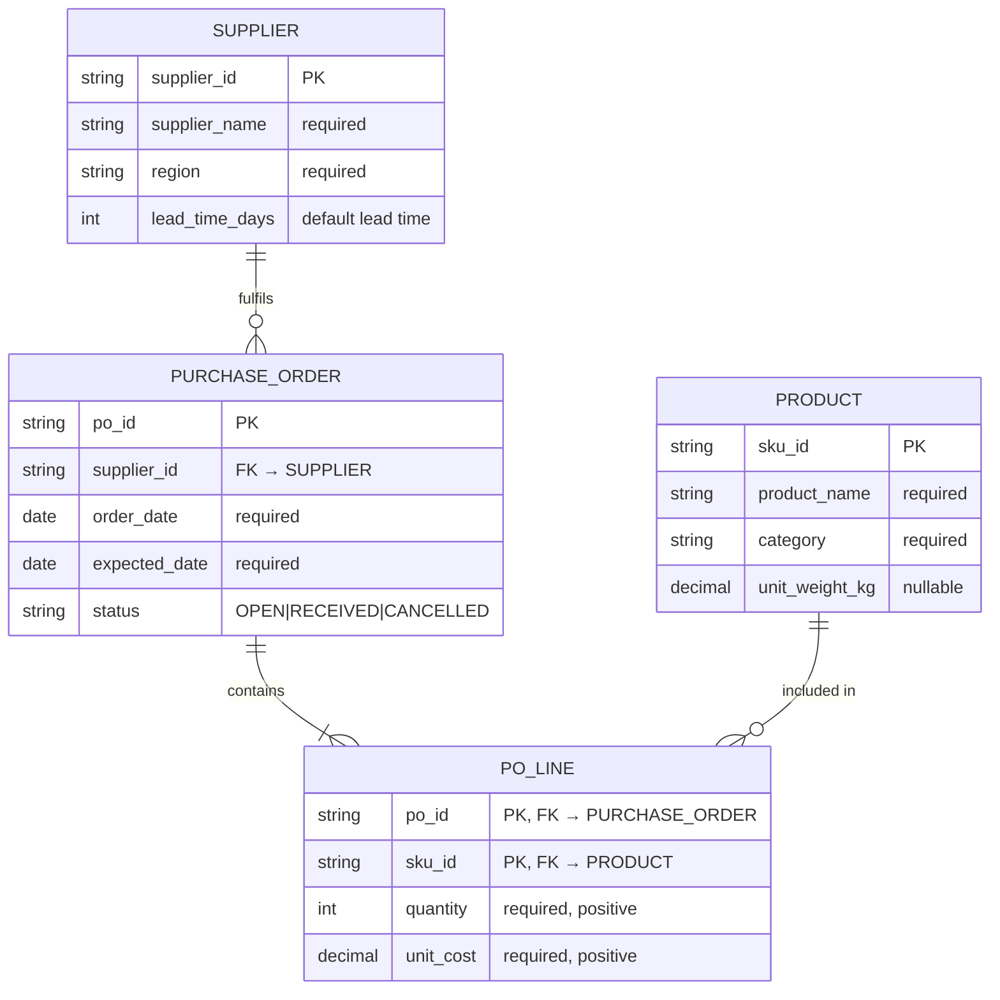

# Data Modeling Guide

Reference for designing physical data models across medallion layers. Covers ERD notation,
normalization, physical type mapping, and data dictionary format.

---

## Modeling Levels

| Level | Purpose | Audience | Detail |
|---|---|---|---|
| **Conceptual** | Business concepts and scope | Business stakeholders | Entities, high-level relationships only |
| **Logical** | Technology-independent structure | Analysts, designers | All entities, attributes, relationships, normalization |
| **Physical** | Implementation-ready spec | Developers | Tables, columns, types, indexes, partitioning |

For data product design, work through all three levels per layer. Bronze = conceptual only.
Silver and Gold = logical then physical.

---

## ERD Notation (Crow's Foot)

Use Mermaid `erDiagram` blocks for all ERDs. Crow's Foot is the standard.

### Cardinality Symbols

| Symbol | Meaning |
|---|---|
| `\|\|` | Exactly one (mandatory) |
| `\|o` | Zero or one (optional) |
| `}\|` | One or many (mandatory many) |
| `}o` | Zero or many (optional many) |

### Entity Block Format

```
ENTITY_NAME {
    type  column_name  "PK/FK/UK – description"
    type  column_name  "description"
}
```

### Full Example



---

## Entity Types

| Type | Description | Example |
|---|---|---|
| **Strong** | Exists independently | Supplier, Product, Warehouse |
| **Weak** | Depends on a parent entity | PO Line (depends on PO) |
| **Associative** | Resolves a many-to-many | PO Line (Supplier ↔ Product) |

---

## Attribute Types

| Type | Notation | Description |
|---|---|---|
| Primary Key | PK | Unique row identifier |
| Foreign Key | FK → table.column | Reference to another entity |
| Unique | UK | Unique but not the primary key |
| Required | NOT NULL / required | Must have a value |
| Optional | nullable | May be null |
| Derived | (computed) | Calculated from other columns — do not store unless performance demands it |

### Key Selection Rules

- Prefer **surrogate keys** (system-generated integer or UUID) as primary keys in Silver and Gold
- Keep **natural/business keys** as unique constraints alongside the surrogate key — don't lose them
- Composite keys are acceptable in associative (junction) tables (e.g., `[po_id, sku_id]`)

---

## Normalization

Apply normalization to Silver tables. Gold tables may be intentionally denormalized for query performance.

### Normal Forms

| Form | Rule | What to fix |
|---|---|---|
| **1NF** | Atomic values, no repeating groups | Split `phone1, phone2, phone3` → a separate phones table |
| **2NF** | No partial dependencies (applies to composite keys) | If `sku_name` depends only on `sku_id` in a `[po_id, sku_id]` table, move it to a product table |
| **3NF** | No transitive dependencies | If `category_manager` depends on `category` which depends on `sku_id`, extract a category table |

### When to Denormalize (Gold Layer)

Denormalization is intentional and justified in Gold when:
- A join is performed on every query and the join cost is measurable
- The dimension is small and stable (low update frequency)
- Reporting tools benefit from flat structures

Always document **why** a Gold table is denormalized and what update risk that creates.

---

## Resolving Many-to-Many Relationships

M:N relationships always require an associative table in Silver and Gold:

```
Demand Forecast ──M:N── Product

Becomes:

Demand Forecast ──1:M── Forecast Line ──M:1── Product
```

The associative table carries the relationship's own attributes (e.g., `forecasted_quantity`,
`forecast_confidence`).

---

## Physical Model — Type Mapping

Use these type mappings when writing column specs in `contract.yml`.

| Logical Type | Delta Lake / Spark SQL | PostgreSQL | DuckDB |
|---|---|---|---|
| Short string (≤255) | STRING | VARCHAR(255) | VARCHAR |
| Long text | STRING | TEXT | TEXT |
| Integer | INT | INTEGER | INTEGER |
| Large integer | BIGINT | BIGINT | BIGINT |
| Decimal (precision) | DECIMAL(p,s) | NUMERIC(p,s) | DECIMAL(p,s) |
| Float | DOUBLE | DOUBLE PRECISION | DOUBLE |
| Boolean | BOOLEAN | BOOLEAN | BOOLEAN |
| Date | DATE | DATE | DATE |
| Timestamp (UTC) | TIMESTAMP | TIMESTAMPTZ | TIMESTAMPTZ |
| JSON / semi-structured | MAP / STRUCT / VARIANT | JSONB | JSON |
| Array | ARRAY\<type\> | ARRAY | type[] |

---

## Indexing and Partitioning

### Partitioning (Delta / Iceberg)

Partition columns determine how files are physically split on storage. Choose columns that:
- Are frequently used in WHERE filters
- Have moderate cardinality (not too many, not too few values)
- Align with how data ages (date partitioning = easy time-travel and pruning)

Good partition columns for supply chain: `order_date`, `warehouse_id`, `region`, `ingestion_date`

Avoid partitioning on high-cardinality columns like `order_id` or `sku_id` — this creates too many small files.

### Z-Ordering / Liquid Clustering (Delta)

For Silver and Gold tables, apply Z-ORDER on columns commonly used together in filters:

```sql
-- Z-ORDER Silver demand fact on most common filter combo
OPTIMIZE silver.fct_demand ZORDER BY (sku_id, warehouse_id, order_date);

-- Liquid clustering (preferred for new Delta tables)
CREATE TABLE gold.dim_products
CLUSTER BY (category, supplier_id);
```

### Indexes (Transactional Layer)

For tables in the transactional layer, always define an index on the lookup key:

| Read Pattern | Index Type |
|---|---|
| Point lookup by single key | Single-column B-tree |
| Point lookup by composite key | Composite B-tree |
| Range scan on date | B-tree on date column |
| Full-text search | Not covered — use a search index separately |

---

## Data Dictionary Format

For each table, document using this format in `data_model.md`:

```markdown
### silver_fct_demand

**Layer**: Silver
**Description**: Cleaned, deduplicated demand fact table. One row per order line.
**Partition**: order_date
**Primary Key**: order_id
**Refresh**: Event-triggered after ingest_demand_raw completes

| Column | Type | Nullable | Key | Description |
|---|---|---|---|---|
| order_id | STRING | No | PK | Unique order identifier from source ERP |
| sku_id | STRING | No | FK → gold_dim_products.sku_id | Product SKU |
| warehouse_id | STRING | No | FK → gold_dim_warehouses.warehouse_id | Fulfilling warehouse |
| quantity_ordered | INT | No | | Units ordered by customer |
| quantity_fulfilled | INT | Yes | | Units actually shipped; null if order still open |
| order_date | DATE | No | | Date order was placed |
| status | STRING | No | | OPEN \| FULFILLED \| CANCELLED \| PARTIAL |
| _ingested_at | TIMESTAMP | No | | System: when this record entered the platform |
| _source_system | STRING | No | | System: origin system identifier |

**Constraints**:
- quantity_ordered > 0
- status IN ('OPEN', 'FULFILLED', 'CANCELLED', 'PARTIAL')
- order_date NOT NULL and not in the future

**Quality Checks** (enforced by transform job):
- No null order_id, sku_id, order_date
- No duplicate order_id
- Referential integrity: sku_id exists in gold_dim_products
```

---

## SCD (Slowly Changing Dimensions)

For Gold dimension tables that track changes over time, choose an SCD strategy:

| Strategy | Behaviour | Use when |
|---|---|---|
| **SCD0** | Never update — keep original value | Immutable attributes (birth date, system ID) |
| **SCD1** | Overwrite — only current value kept | Low-stakes changes where history is not needed |
| **SCD2** | Add new row — full history kept | Important attributes where history matters (lead time, price tier) |

SCD2 columns to add: `valid_from TIMESTAMP`, `valid_to TIMESTAMP`, `is_current BOOLEAN`

Avoid SCD2 on high-churn attributes — it can balloon table size. If change history matters but SCD2 overhead is too high, consider an append-only audit table instead.
